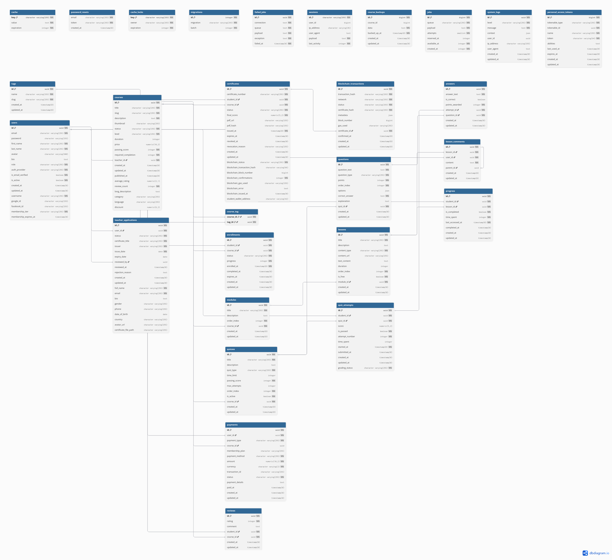

# Database Schema

This document describes the database schema for the Certchain platform. The database uses PostgreSQL with UUID primary keys for all tables.

## Entity Relationship Diagram


---

## Model Descriptions

### Users

Primary user table storing all user accounts (students, teachers, admins).

| Column | Type | Description |
|--------|------|-------------|
| `id` | UUID (PK) | Unique identifier |
| `first_name` | VARCHAR | User's first name |
| `last_name` | VARCHAR | User's last name |
| `email` | VARCHAR (unique) | Email address for login |
| `username` | VARCHAR (unique) | Public username |
| `password` | VARCHAR (nullable) | Hashed password (null for OAuth users) |
| `auth_provider` | ENUM | `local`, `google`, `facebook` |
| `role` | ENUM | `STUDENT`, `TEACHER`, `ADMIN` |
| `bio` | TEXT | User biography |
| `avatar` | VARCHAR | Avatar URL in storage |
| `is_active` | BOOLEAN | Account active status |
| `google_id` | VARCHAR | Google OAuth ID |
| `facebook_id` | VARCHAR | Facebook OAuth ID |
| `membership_tier` | ENUM | `FREE`, `PREMIUM` |
| `membership_expires_at` | TIMESTAMP | Premium expiration date |
| `created_at` | TIMESTAMP | Account creation time |
| `updated_at` | TIMESTAMP | Last update time |

**Relationships:**
- Has many `Courses` (as teacher)
- Has many `Enrollments` (as student)
- Has many `Reviews`
- Has many `Certificates`
- Has many `Payments`
- Has many `TeacherApplications`

---

### Courses

Stores course information created by teachers.

| Column | Type | Description |
|--------|------|-------------|
| `id` | UUID (PK) | Unique identifier |
| `title` | VARCHAR | Course title |
| `slug` | VARCHAR (unique) | URL-friendly identifier |
| `description` | TEXT | Short description |
| `long_description` | TEXT | Detailed description |
| `thumbnail` | VARCHAR | Thumbnail image URL |
| `level` | ENUM | `BEGINNER`, `INTERMEDIATE`, `ADVANCED` |
| `price` | DECIMAL | Course price (0 for free) |
| `discount` | INTEGER | Discount percentage |
| `duration` | INTEGER | Estimated duration in minutes |
| `status` | ENUM | `DRAFT`, `PENDING`, `PUBLISHED`, `REJECTED` |
| `teacher_id` | UUID (FK) | Reference to teacher (Users) |
| `passing_score` | INTEGER | Minimum score to pass (%) |
| `category` | VARCHAR | Course category |
| `language` | VARCHAR | Course language |
| `created_at` | TIMESTAMP | Creation time |
| `updated_at` | TIMESTAMP | Last update time |

**Relationships:**
- Belongs to `User` (teacher)
- Has many `Modules`
- Has many `Enrollments`
- Has many `Reviews`
- Has many `Quizzes`
- Belongs to many `Tags`

---

### Modules

Organizes course content into sections.

| Column | Type | Description |
|--------|------|-------------|
| `id` | UUID (PK) | Unique identifier |
| `title` | VARCHAR | Module title |
| `order_index` | INTEGER | Display order |
| `course_id` | UUID (FK) | Reference to course |
| `created_at` | TIMESTAMP | Creation time |
| `updated_at` | TIMESTAMP | Last update time |

**Relationships:**
- Belongs to `Course`
- Has many `Lessons`

---

### Lessons

Individual learning units within modules.

| Column | Type | Description |
|--------|------|-------------|
| `id` | UUID (PK) | Unique identifier |
| `title` | VARCHAR | Lesson title |
| `content_type` | ENUM | `VIDEO`, `TEXT`, `PDF`, `QUIZ` |
| `content_url` | VARCHAR | Content file URL |
| `duration` | INTEGER | Lesson duration in seconds |
| `order_index` | INTEGER | Display order within module |
| `is_free` | BOOLEAN | Free preview flag |
| `module_id` | UUID (FK) | Reference to module |
| `created_at` | TIMESTAMP | Creation time |
| `updated_at` | TIMESTAMP | Last update time |

**Relationships:**
- Belongs to `Module`
- Has many `Progress` entries
- Has many `LessonComments`

---

### Enrollments

Tracks student course enrollments.

| Column | Type | Description |
|--------|------|-------------|
| `id` | UUID (PK) | Unique identifier |
| `student_id` | UUID (FK) | Reference to student (Users) |
| `course_id` | UUID (FK) | Reference to course |
| `status` | ENUM | `ACTIVE`, `COMPLETED`, `DROPPED` |
| `progress` | INTEGER | Completion percentage (0-100) |
| `completed_at` | TIMESTAMP | Course completion time |
| `created_at` | TIMESTAMP | Enrollment time |
| `updated_at` | TIMESTAMP | Last update time |

**Relationships:**
- Belongs to `User` (student)
- Belongs to `Course`

---

### Progress

Tracks lesson completion per student.

| Column | Type | Description |
|--------|------|-------------|
| `id` | UUID (PK) | Unique identifier |
| `student_id` | UUID (FK) | Reference to student (Users) |
| `lesson_id` | UUID (FK) | Reference to lesson |
| `is_completed` | BOOLEAN | Completion status |
| `time_spent` | INTEGER | Time spent in seconds |
| `completed_at` | TIMESTAMP | Completion time |
| `last_accessed_at` | TIMESTAMP | Last access time |
| `created_at` | TIMESTAMP | Creation time |
| `updated_at` | TIMESTAMP | Last update time |

**Relationships:**
- Belongs to `User` (student)
- Belongs to `Lesson`

---

### Quizzes

Assessment quizzes within courses.

| Column | Type | Description |
|--------|------|-------------|
| `id` | UUID (PK) | Unique identifier |
| `title` | VARCHAR | Quiz title |
| `description` | TEXT | Quiz description |
| `quiz_type` | ENUM | `PRACTICE`, `GRADED`, `FINAL` |
| `time_limit` | INTEGER | Time limit in minutes (null = unlimited) |
| `passing_score` | INTEGER | Minimum passing score (%) |
| `max_attempts` | INTEGER | Maximum allowed attempts (null = unlimited) |
| `order_index` | INTEGER | Display order |
| `is_active` | BOOLEAN | Active status |
| `course_id` | UUID (FK) | Reference to course |
| `created_at` | TIMESTAMP | Creation time |
| `updated_at` | TIMESTAMP | Last update time |

**Relationships:**
- Belongs to `Course`
- Has many `Questions`
- Has many `QuizAttempts`

---

### Questions

Quiz questions with multiple types support.

| Column | Type | Description |
|--------|------|-------------|
| `id` | UUID (PK) | Unique identifier |
| `question_text` | TEXT | Question content |
| `question_type` | ENUM | `MULTIPLE_CHOICE`, `TRUE_FALSE`, `SHORT_ANSWER`, `ESSAY` |
| `points` | INTEGER | Points for correct answer |
| `order_index` | INTEGER | Display order |
| `options` | JSON | Answer options for MCQ |
| `correct_answer` | VARCHAR | Correct answer |
| `explanation` | TEXT | Answer explanation |
| `quiz_id` | UUID (FK) | Reference to quiz |
| `created_at` | TIMESTAMP | Creation time |
| `updated_at` | TIMESTAMP | Last update time |

**Relationships:**
- Belongs to `Quiz`
- Has many `Answers`

---

### Quiz Attempts

Student quiz attempt records.

| Column | Type | Description |
|--------|------|-------------|
| `id` | UUID (PK) | Unique identifier |
| `student_id` | UUID (FK) | Reference to student (Users) |
| `quiz_id` | UUID (FK) | Reference to quiz |
| `score` | DECIMAL | Final score |
| `is_passed` | BOOLEAN | Pass/fail status |
| `grading_status` | ENUM | `PENDING`, `GRADING`, `GRADED` |
| `attempt_number` | INTEGER | Attempt sequence number |
| `time_spent` | INTEGER | Time spent in seconds |
| `started_at` | TIMESTAMP | Start time |
| `submitted_at` | TIMESTAMP | Submission time |
| `created_at` | TIMESTAMP | Creation time |
| `updated_at` | TIMESTAMP | Last update time |

**Relationships:**
- Belongs to `User` (student)
- Belongs to `Quiz`
- Has many `Answers`

---

### Answers

Student answers to quiz questions.

| Column | Type | Description |
|--------|------|-------------|
| `id` | UUID (PK) | Unique identifier |
| `question_id` | UUID (FK) | Reference to question |
| `attempt_id` | UUID (FK) | Reference to quiz attempt |
| `answer_text` | TEXT | Free-form answer text |
| `selected_option` | VARCHAR | Selected option for MCQ |
| `is_correct` | BOOLEAN | Correctness flag |
| `points_earned` | DECIMAL | Points awarded |
| `feedback` | TEXT | Teacher feedback |
| `graded_at` | TIMESTAMP | Grading time |
| `created_at` | TIMESTAMP | Creation time |
| `updated_at` | TIMESTAMP | Last update time |

**Relationships:**
- Belongs to `Question`
- Belongs to `QuizAttempt`

---

### Certificates

Course completion certificates with blockchain tracking.

| Column | Type | Description |
|--------|------|-------------|
| `id` | UUID (PK) | Unique identifier |
| `certificate_number` | VARCHAR (unique) | Public certificate ID |
| `student_id` | UUID (FK) | Reference to student (Users) |
| `course_id` | UUID (FK) | Reference to course |
| `final_score` | DECIMAL | Final course score |
| `pdf_url` | VARCHAR | Certificate PDF URL |
| `pdf_hash` | VARCHAR | SHA-256 hash of PDF |
| `pdf_path` | VARCHAR | Storage path |
| `status` | ENUM | `ISSUED`, `REVOKED` |
| `issued_at` | TIMESTAMP | Issue date |
| `revoked_at` | TIMESTAMP | Revocation date |
| `revocation_reason` | TEXT | Reason for revocation |
| `blockchain_status` | ENUM | `PENDING`, `CONFIRMED`, `FAILED` |
| `blockchain_transaction_hash` | VARCHAR | Blockchain tx hash |
| `blockchain_block_number` | INTEGER | Block number |
| `blockchain_confirmations` | INTEGER | Confirmation count |
| `blockchain_gas_used` | VARCHAR | Gas used |
| `blockchain_error` | TEXT | Error message if failed |
| `blockchain_issued_at` | TIMESTAMP | Blockchain confirmation time |
| `student_wallet_address` | VARCHAR | Student's wallet address |
| `certificate_data` | JSON | Additional metadata |
| `created_at` | TIMESTAMP | Creation time |
| `updated_at` | TIMESTAMP | Last update time |

**Relationships:**
- Belongs to `User` (student)
- Belongs to `Course`
- Has one `BlockchainTransaction`

---

### Blockchain Transactions

Tracks all blockchain operations.

| Column | Type | Description |
|--------|------|-------------|
| `id` | UUID (PK) | Unique identifier |
| `transaction_hash` | VARCHAR | Blockchain tx hash |
| `network` | VARCHAR | Blockchain network used |
| `certificate_hash` | VARCHAR | Hash of certificate data |
| `metadata` | JSON | Additional tx metadata |
| `status` | ENUM | `PENDING`, `CONFIRMED`, `FAILED` |
| `certificate_id` | UUID (FK) | Reference to certificate |
| `confirmed_at` | TIMESTAMP | Confirmation time |
| `created_at` | TIMESTAMP | Creation time |
| `updated_at` | TIMESTAMP | Last update time |

**Relationships:**
- Belongs to `Certificate`

---

### Payments

Payment transaction records.

| Column | Type | Description |
|--------|------|-------------|
| `id` | UUID (PK) | Unique identifier |
| `user_id` | UUID (FK) | Reference to user |
| `payment_type` | ENUM | `COURSE`, `MEMBERSHIP` |
| `course_id` | UUID (FK, nullable) | Reference to course |
| `membership_plan` | VARCHAR | Membership plan purchased |
| `payment_method` | ENUM | `STRIPE`, `PAYPAL` |
| `amount` | DECIMAL | Payment amount |
| `currency` | VARCHAR | Currency code (USD) |
| `transaction_id` | VARCHAR | Payment provider tx ID |
| `status` | ENUM | `PENDING`, `COMPLETED`, `FAILED`, `REFUNDED` |
| `payment_details` | JSON | Provider-specific details |
| `paid_at` | TIMESTAMP | Payment completion time |
| `created_at` | TIMESTAMP | Creation time |
| `updated_at` | TIMESTAMP | Last update time |

**Relationships:**
- Belongs to `User`
- Belongs to `Course` (optional)

---

### Teacher Applications

Teacher registration applications.

| Column | Type | Description |
|--------|------|-------------|
| `id` | UUID (PK) | Unique identifier |
| `user_id` | UUID (FK) | Reference to applicant (Users) |
| `status` | ENUM | `PENDING`, `APPROVED`, `REJECTED` |
| `full_name` | VARCHAR | Full legal name |
| `email` | VARCHAR | Contact email |
| `bio` | TEXT | Professional biography |
| `gender` | VARCHAR | Gender |
| `phone` | VARCHAR | Phone number |
| `date_of_birth` | DATE | Birth date |
| `country` | VARCHAR | Country |
| `avatar_url` | VARCHAR | Profile photo |
| `certificate_title` | VARCHAR | Teaching certificate title |
| `issuer` | VARCHAR | Certificate issuer |
| `issue_date` | DATE | Certificate issue date |
| `expiry_date` | DATE | Certificate expiry date |
| `certificate_file_path` | VARCHAR | Uploaded certificate file |
| `reviewed_by` | UUID (FK) | Admin who reviewed |
| `reviewed_at` | TIMESTAMP | Review date |
| `rejection_reason` | TEXT | Reason if rejected |
| `created_at` | TIMESTAMP | Submission time |
| `updated_at` | TIMESTAMP | Last update time |

**Relationships:**
- Belongs to `User` (applicant)
- Belongs to `User` (reviewer)

---

### Tags

Course categorization tags.

| Column | Type | Description |
|--------|------|-------------|
| `id` | UUID (PK) | Unique identifier |
| `name` | VARCHAR (unique) | Tag name |
| `created_at` | TIMESTAMP | Creation time |
| `updated_at` | TIMESTAMP | Last update time |

**Relationships:**
- Belongs to many `Courses`

---

### Reviews

Course reviews by students.

| Column | Type | Description |
|--------|------|-------------|
| `id` | UUID (PK) | Unique identifier |
| `student_id` | UUID (FK) | Reference to student (Users) |
| `course_id` | UUID (FK) | Reference to course |
| `rating` | INTEGER | Rating (1-5) |
| `comment` | TEXT | Review text |
| `created_at` | TIMESTAMP | Creation time |
| `updated_at` | TIMESTAMP | Last update time |

**Relationships:**
- Belongs to `User` (student)
- Belongs to `Course`

---

### System Logs

Audit log for system actions.

| Column | Type | Description |
|--------|------|-------------|
| `id` | UUID (PK) | Unique identifier |
| `action` | VARCHAR | Action type |
| `entity_type` | VARCHAR | Entity affected |
| `entity_id` | UUID | Entity ID |
| `user_id` | UUID (FK) | User who performed action |
| `metadata` | JSON | Additional details |
| `ip_address` | VARCHAR | User's IP address |
| `user_agent` | VARCHAR | Browser/client info |
| `created_at` | TIMESTAMP | Action time |

**Relationships:**
- Belongs to `User`

---

## Indexes

Key indexes for performance:

```sql
-- Users
CREATE INDEX idx_users_email ON users(email);
CREATE INDEX idx_users_role ON users(role);

-- Courses
CREATE INDEX idx_courses_teacher_id ON courses(teacher_id);
CREATE INDEX idx_courses_status ON courses(status);
CREATE INDEX idx_courses_slug ON courses(slug);

-- Enrollments
CREATE INDEX idx_enrollments_student_course ON enrollments(student_id, course_id);
CREATE INDEX idx_enrollments_status ON enrollments(status);

-- Certificates
CREATE INDEX idx_certificates_number ON certificates(certificate_number);
CREATE INDEX idx_certificates_student ON certificates(student_id);
CREATE INDEX idx_certificates_blockchain_status ON certificates(blockchain_status);

-- Progress
CREATE INDEX idx_progress_student_lesson ON progress(student_id, lesson_id);
```

---

## Migration Commands

```bash
# Run migrations
php artisan migrate

# Rollback last batch
php artisan migrate:rollback

# Reset and re-run all migrations
php artisan migrate:fresh

# Seed database
php artisan db:seed

# Fresh migration with seeding
php artisan migrate:fresh --seed
```
